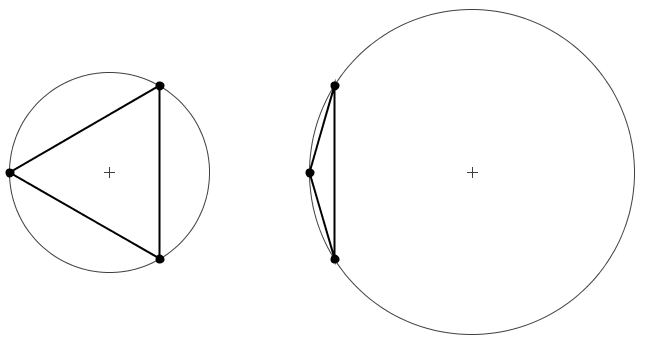

[comment]: # "This is the standard layout for the project, but you can clean this and use your own template"

# Software Package To Support Agent Based Modelling Based Decision Making

#### Team

-  E/18/017, Aarah J.F., [e18017@eng.pdn.ac.lk](mailto:e18017@eng.pdn.ac.lk)
-  E/18/177, Khan A.K.M.S., [e18177@eng.pdn.ac.lk](mailto:e18177@eng.pdn.ac.lk)
-  E/18/304, Rishad N.M., [e18304@eng.pdn.ac.lk](mailto:e18304@eng.pdn.ac.lk)

#### Supervisors

- Dr. Damayanthi Herath, [damayanthiherath@eng.pdn.ac.lk](mailto:damayanthiherath@eng.pdn.ac.lk)
- Dr. Rajith Vidanaarachchi, [rajith.v@unimelb.edu.au](mailto:rajith.v@unimelb.edu.au)

#### Table of content

1. [Abstract](#abstract)
2. [Introduction](#introduction)
3. [Related works](#related-works)
4. [Methodology](#methodology)
5. [Experiment Setup and Implementation](#experiment-setup-and-implementation)
6. [Results and Analysis](#results-and-analysis)
7. [Conclusion](#conclusion)
8. [Publications](#publications)
9. [Links](#links)

---

<!-- 
DELETE THIS SAMPLE before publishing to GitHub Pages !!!
This is a sample image, to show how to add images to your page. To learn more options, please refer [this](https://projects.ce.pdn.ac.lk/docs/faq/how-to-add-an-image/)
 
-->

## Introduction
Agent-Based Modeling (ABM) stands as a powerful methodology for understanding complex systems and decision-making processes by simulating interactions and behaviors of individual entities, or agents, in a given environment. While the Mesa Python framework plays a significant role in ABM, its limitation to two-dimensional (2D) spaces restricts its applicability in scenarios requiring detailed three-dimensional (3D) representation.

This research addresses Mesa's 2D limitations by proposing an upgrade to support spatial simulations in 3D environments, specifically through triangular mesh visualization. The Delaunay triangulation algorithm is leveraged to construct high-quality triangular meshes that accurately represent irregular surfaces, facilitating real-time visualizations. This enhancement is particularly valuable in fields such as geography, urban planning, and environmental science, where understanding spatial relationships is crucial.

The motivation for this upgrade stems from a gap in existing literature, notably highlighted by Patel's 2019 work, which emphasizes the need to expand Mesa's class structure to include (x, y, z) positions for agents. This extension is essential for more realistic simulations, moving beyond Mesa's current HexGrid, which only accommodates (x, y) positions.

Informed by a comparative analysis of various ABM tools, Mesa was chosen for this upgrade due to its use of Python—a widely adopted, user-friendly programming language favored within the scientific community. Python's extensive libraries for data processing and analysis further enhance its suitability for scientific research and modeling. Mesa's non-proprietary nature and compatibility with Python's ecosystem make it a flexible and adaptable framework compared to other ABM tools that use proprietary languages or lack such flexibility.

The core of this research is the implementation of Triangular Mesh within Mesa, enhancing its spatial simulation capabilities. Triangular Meshes provide a detailed and accurate representation of environments, capturing irregularities essential for precision in environmental simulations, structural engineering, and astronomy.

The paper outlines the methodology for upgrading Mesa, including integration strategies, validation through case studies, implementation of Triangular Mesh, performance evaluation, and considerations for scalability and generalization. The enhanced Mesa framework aims to meet the diverse needs of decision-makers using ABM, offering advanced representation of spatial dynamics applicable across various fields.

In conclusion, this research aims to elevate the Mesa Python framework by introducing 3D support through Triangular Meshes. This enhancement is expected to substantially improve the realism and accuracy of spatial simulations within ABM, significantly contributing to computational modeling and decision-making.

## 3D Visualization
Agent-Based Modeling (ABM) using Mesa has traditionally been confined to two-dimensional (2D) spaces, restricting the ability to accurately simulate and visualize complex environments. Figure 1 illustrates a typical 2D representation of a mesh, which simplifies spatial relationships and fails to capture the vertical dimension crucial for many real-world applications.

The shift towards three-dimensional (3D) representation is essential for modeling and understanding environments where vertical spatial relationships significantly impact agent interactions and decision-making processes. Figure 2 depicts a 3D representation of a mesh, highlighting the added dimension that provides a more realistic and comprehensive view of the environment.

we propose an advanced triangular mesh solution aimed at enhancing the 3D visualization of irregular surfaces within the Mesa agent-based modeling framework. This solution leverages the Delaunay triangulation algorithm, chosen for its superior ability to optimally represent irregular surfaces compared to other methods.

### Why Triangular Mesh?
The triangular mesh approach is widely recognized for its efficiency and accuracy in depicting complex and irregular surfaces. Triangles, being the simplest polygon, allow for flexible and precise modeling of surface geometry, making them particularly suitable for rendering detailed 3D structures. This method ensures that the resulting mesh is both geometrically accurate and computationally efficient, facilitating real-time visualization and interaction.

### Delaunay Triangulation Algorithm
To develop the triangular mesh, we utilize the Delaunay triangulation algorithm. This algorithm is preferred because it constructs a mesh that maximizes the minimum angle of all the angles of the triangles in the triangulation, avoiding skinny triangles. This property, known as the Delaunay criterion, ensures a high-quality mesh by maintaining:
<table>
  <tr>
    <td>
      
    </td>
    <td>
      Delaunay Criterion
      <ul>
      <li>All triangles have non-zero area, preventing degenerate cases where triangles collapse into lines or points.</li>
      <li>The circumcircle (circle passing through all three vertices) of each triangle does not contain any other vertices of the mesh, ensuring optimal vertex connectivity and mesh stability.</li>
      <li>The resulting mesh balances computational efficiency with geometric accuracy, making it suitable for high-fidelity 3D visualizations.</li>
    </ul>
    </td>
  </tr>
</table>

### Integration with Mesa Agent-Based Modeling Framework
The integration of this triangular mesh solution into the Mesa framework significantly enhances its capabilities for 3D visualization. Mesa, a robust agent-based modeling library in Python, benefits from this addition by enabling detailed and dynamic representations of agent interactions and environmental changes over irregular terrains.

This enhancement facilitates the exploration of complex systems in a more intuitive and visually engaging manner. Researchers and developers can now visualize how agents interact with their environment in three dimensions, gaining deeper insights into spatial dynamics and emergent behaviors.

<!--## Methodology

## Experiment Setup and Implementation

## Results and Analysis-->

## Conclusion
In conclusion, this research significantly advances Agent-Based Modeling (ABM) by proposing a transformative extension to the Mesa Python framework, aiming to overcome its 2D limitations. Through the integration of Triangular Meshes, our study enhances Mesa's spatial simulation capabilities, addressing the crucial need for accurate representation of complex surfaces and terrains in decision-making scenarios. The carefully considered choice of Mesa as the preferred ABM framework, based on its use of Python and non-proprietary nature, aligns with the current trends in the scientific community, ensuring a user-friendly and adaptable environment.

The proposed software package resulting from this research holds great promise for decision-makers using ABM, offering an advanced representation of spatial dynamics applicable across diverse fields. By presenting a meticulous methodology, case study validations, and performance evaluations, this research establishes a robust foundation for upgrading Mesa and introduces 3D support through Triangular Meshes. Ultimately, this work contributes significantly to the broader landscape of computational modeling and decision-making, fostering advancements in spatial simulations within the realm of ABM.

## Reference
[1] D. Masad and J. Kazil, “Mesa: An Agent-Based Modeling Framework,” 2015. Available: https://conference.scipy.org/proceedings/scipy2015/pdfs/jacqueline-kazil.pdf

[2] J. Kazil, D. Masad, and A. Crooks, “Utilizing Python for Agent-Based Modeling: The Mesa Framework,” Lecture Notes in Computer Science, pp. 308–317, Jan. 2020, doi: https://doi.org/10.1007/978-3-030-61255-9-30.

[3] “Applications of Agent-Based Models in Cancer Research and Epidemiological Simulations,” Research Explorer The University of Manchester. https://research.manchester.ac.uk/en/studentTheses/applications-of-agent-based-models-in-cancer-research-and-epidemi (accessed Feb. 09, 2024).

[4] A. Antelmi, G. Cordasco, G. D’Ambrosio, D. De Vinco, and C. Spagnuolo, “Experimenting with Agent-Based Model Simulation Tools,” Applied Sciences, vol. 13, no. 1, p. 13, Dec. 2022, doi: https://doi.org/10.3390/app13010013.

[5] S. F. Railsback, S. L. Lytinen, and S. K. Jackson, “Agent-based Simulation Platforms: Review and Development Recommendations,” SIMULATION, vol. 82, no. 9, pp. 609–623, Sep. 2006, doi: https://doi.org/10.1177/0037549706073695.

[6] Allan, R.J.. (2009). Survey of Agent Based Modelling and Simulation Tools.

[7] S. Abar, G. K. Theodoropoulos, P. Lemarinier, and G. M. P. O’Hare, “Agent Based Modelling and Simulation tools: A review of the state-of-art software,” Computer Science Review, vol. 24, pp. 13–33, May 2017, doi: https://doi.org/10.1016/j.cosrev.2017.03.001.

<!--
## Publications
[//]: # "Note: Uncomment each once you uploaded the files to the repository"

<!-- 1. [Semester 7 report](./) -->
<!-- 2. [Semester 7 slides](./) -->
<!-- 3. [Semester 8 report](./) -->
<!-- 4. [Semester 8 slides](./) -->
<!-- 5. Author 1, Author 2 and Author 3 "Research paper title" (2021). [PDF](./). -->
## Links

[//]: # ( NOTE: EDIT THIS LINKS WITH YOUR REPO DETAILS )

- [Project Repository](https://github.com/cepdnaclk/e18-4yp-Software-Package-To-Support-Agent-Based-Modelling-Based-Decision-Making)
- [Project Page](https://cepdnaclk.github.io/e18-4yp-Software-Package-To-Support-Agent-Based-Modelling-Based-Decision-Making)
- [Department of Computer Engineering](http://www.ce.pdn.ac.lk/)
- [University of Peradeniya](https://eng.pdn.ac.lk/)

[//]: # "Please refer this to learn more about Markdown syntax"
[//]: # "https://github.com/adam-p/markdown-here/wiki/Markdown-Cheatsheet"
